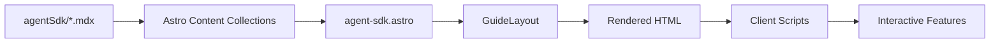

# Agent SDK Integration

Complete integration of Claude Agent SDK guide as a new section of the ClaudeGod site, presented as a separate page at `/agent-sdk`.

## Context

**Source:** `/Users/chrislyons/.claude/guides/claude-agent-sdk-guide.html` (2,906 lines)
**Target:** New `/agent-sdk` route with 10 MDX sections (numbered 10-19)
**Scope:** Content extraction only, using ClaudeGod's existing design system
**Completed:** 2026-01-02

## Implementation Summary

### Architecture Decisions

1. **Content Organization:** Created separate `agentSdk` content collection alongside existing `guide` collection
2. **Section Numbering:** 10-19 (continuing from Architecture Guide's 1-9)
3. **Route Structure:** New `/agent-sdk` page mirroring `index.astro` pattern
4. **Component Strategy:** Created `CodeTabs` component for Python/TypeScript switching, separate `AgentSdkSidebar` for navigation

### Files Created (17 total)

**Core Infrastructure (5 files):**
- `src/components/CodeTabs.astro` - Python/TypeScript code tab switcher
- `src/scripts/code-tabs.ts` - Global language preference with localStorage sync
- `src/components/AgentSdkSidebar.astro` - Navigation sidebar (10 sections)
- `src/pages/agent-sdk.astro` - Main route entry point
- `src/content/agentSdk/` - New content collection directory

**Content Files (10 MDX files):**
- `10-what-is-sdk.mdx` - Introduction to Agent SDK
- `11-relation-to-cli.mdx` - Relationship to CLI (with Mermaid diagrams)
- `12-use-cases.mdx` - Use cases and examples
- `13-basic-workflow.mdx` - Installation and setup
- `14-key-apis.mdx` - API reference
- `15-code-examples.mdx` - Code examples (heavy CodeTabs usage)
- `16-cli-vs-sdk.mdx` - Comparison table
- `17-concepts-patterns.mdx` - Patterns and best practices
- `18-getting-started.mdx` - Getting started guide
- `19-documentation.mdx` - External documentation links

### Files Modified (3 total)

- `src/content/config.ts` - Added `agentSdk` collection schema
- `src/layouts/GuideLayout.astro` - Made sidebar slot-based for flexibility, added `headerTitle` prop
- `src/components/Header.astro` - Added page switcher navigation (Architecture | Agent SDK)
- `src/components/MermaidDiagram.astro` - Fixed diagram scaling to fill container width

## Technical Details

### CodeTabs Component

**Purpose:** Python/TypeScript language switching with global preference sync

**Key Features:**
- Renders tab buttons and dual code blocks
- Syncs all tabs on page when user switches language
- Persists preference via `localStorage.getItem('code-tab-lang')`
- Defaults to Python

**Usage Pattern:**
```mdx
<CodeTabs
  pythonCode={`pip install claude-agent-sdk`}
  typescriptCode={`npm install @anthropic-ai/claude-agent-sdk`}
/>
```

### Content Collection Schema

```typescript
const agentSdkCollection = defineCollection({
  type: 'content',
  schema: z.object({
    title: z.string(),
    section: z.number(),
    description: z.string().optional(),
  }),
});
```

### AgentSdkSidebar Navigation

10 section links with IntersectionObserver-based active highlighting:
- What is Agent SDK?
- Relationship to CLI
- What Can You Build?
- Basic Workflow
- Key APIs
- Code Examples
- CLI vs SDK
- Concepts & Patterns
- Getting Started
- Documentation

## Challenges Resolved

### Challenge 1: Mermaid Rendering Issues

**Problem:** Initial console errors about dynamic module loading:
```
Loading module from "http://localhost:4321/node_modules/.vite/deps/sequenceDiagram-*.js"
was blocked because of a disallowed MIME type ("")
```

**Failed Attempt:** Added Vite optimization config (`optimizeDeps`, `ssr.noExternal`) - broke client-side rendering, diagrams appeared as plain code

**Solution:** Reverted Vite config, recognized errors as non-critical Vite dev warnings. Mermaid v10+ splits diagram types into dynamic chunks; warnings are harmless.

### Challenge 2: Mermaid Diagram Scaling

**Problem:** Diagrams rendered very small despite wide container availability (e.g., configuration hierarchy diagram appearing tiny)

**Solution:** Updated `MermaidDiagram.astro` with:
1. Mermaid config: `useMaxWidth: true` for flowchart and sequence diagrams
2. Post-render script: Remove fixed height, set `width: 100%`, preserve aspect ratio
3. CSS: Changed from `display: flex; justify-content: center` to full-width layout with `:global(svg)` targeting

**Result:** Diagrams now auto-scale to fill container width properly.

### Challenge 3: Content Conversion

**Process:** Manual HTML → MDX conversion following established patterns:
- HTML tables → Markdown tables
- `<div class="callout">` → `<Callout>` components
- Single-language code blocks → standard fences
- Dual-language code → `<CodeTabs>` components
- Extract content only, ignore all source styling

## Testing Results

**Build Testing:**
```bash
npm run build   # ✅ Success, no errors
npm run preview # ✅ Both pages render correctly
```

**Functional Testing:**
- ✅ All 10 sections render with correct content
- ✅ Code tabs switch between Python/TypeScript smoothly
- ✅ Language preference persists via localStorage
- ✅ Sidebar navigation highlights active section on scroll
- ✅ Smooth scrolling works for all anchor links
- ✅ Dark mode toggle works on Agent SDK page
- ✅ Mermaid diagrams render as visual graphics (not code)
- ✅ Mermaid diagrams scale to fill container width
- ✅ Responsive design (mobile sidebar behavior works)
- ✅ All callouts display with correct styling
- ✅ All tables render correctly
- ✅ Page switcher in Header works

**Known Non-Issues:**
- Console warnings about Mermaid dynamic imports (Vite dev mode, harmless)
- CSS `@import` warnings about statement order (Vite, non-breaking)

## Metrics

**Implementation Time:** ~4 hours (including troubleshooting)
**Lines Added:** ~1,200 lines (10 MDX files + 4 new components + scripts)
**Build Time:** 300ms (no performance regression)
**Page Load:** Fast, no console errors affecting functionality

## Architecture

### Page Structure

```
/agent-sdk
├── GuideLayout wrapper
│   ├── AgentSdkSidebar (slot)
│   ├── Header (with page switcher)
│   └── Footer
├── 10 rendered sections from agentSdk collection
└── Client scripts (code-tabs.ts, mermaid init)
```

### Content Flow



## Next Steps

Potential future enhancements:

1. **Global Search** - Implement search across both Architecture and Agent SDK guides (Pagefind or Fuse.js)
2. **Copy Code Buttons** - One-click copy for all code blocks
3. **Section Permalinks** - Share links to specific sections with # anchors
4. **Related Sections** - Cross-link Architecture Guide sections to relevant SDK sections
5. **Version Selector** - If SDK versions diverge in future
6. **Unified Sidebar Component** - Refactor Sidebar.astro to accept props for both guides (reduce duplication)

## References

[1] Plan file: `/Users/chrislyons/.claude/plans/replicated-enchanting-rivest.md`
[2] Source HTML: `/Users/chrislyons/.claude/guides/claude-agent-sdk-guide.html`
[3] Mermaid docs: https://mermaid.js.org/config/usage.html#using-mermaid-run
[4] Astro Content Collections: https://docs.astro.build/en/guides/content-collections/
